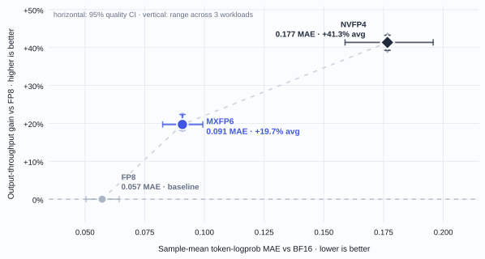
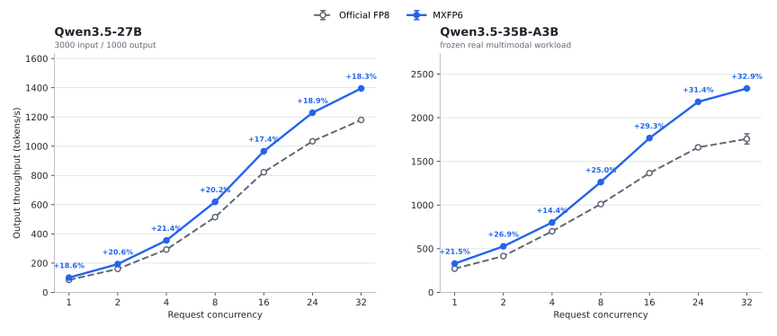

<p align="center">
  <picture>
    <source media="(prefers-color-scheme: dark)" srcset="docs/assets/mxfp6-wordmark-dark.png">
    
  </picture>
</p>

<h3 align="center">
  Native OCP W6A8 execution on NVIDIA SM120 Tensor Cores
</h3>

<p align="center">
  <a href="docs/qwen38-27b.md">Qwen3.8-27B</a> ·
  <a href="#performance">Performance</a> ·
  <a href="#execution-model">Design</a> ·
  <a href="#build">Build</a> ·
  <a href="#python-api">API</a> ·
  <a href="#vllm-integration">vLLM</a> ·
  <a href="CONTRIBUTING.md">Contributing</a>
</p>

<p align="center">
  <a href="LICENSE"></a>
  
  
  
</p>

`mxfp6-sm120` is a PyTorch CUDA extension for native OCP MXFP6 inference on
NVIDIA compute capability 12.0. It keeps weights in packed MXFP6 E3M2, creates
MXFP8 E4M3 activations at runtime, and executes W6A8 matrix products with SM120
block-scaled Tensor Core MMA.

The package covers both execution patterns required by the tested Qwen3.5
models:

| Path | Implementation |
|---|---|
| Dense | Shape-aware W6A8 GEMM for linear, attention and MLP projections |
| Routed MoE | Routing, W1, SiLU-and-mul, intermediate quantization, W2, shared-expert combine and routed/shared reduction |
| Runtime | Persistent workspaces, prewarmed dispatch and CUDA Graph replay |

## Performance

### Qwen3.8-27B quality, serving and capacity snapshot

A frozen RTX 5090 comparison now covers official FP8, MXFP6 and standard
NVFP4 W4A4. Across 256 teacher-forced records, sample-mean token-logprob MAE
against BF16 was 0.05719 for FP8, 0.09078 for MXFP6 and 0.17661 for NVFP4.
MXFP6 therefore reduced MAE by 48.6% relative to NVFP4, while FP8 remained
closest to BF16.

At three TP2 serving workloads, MXFP6 produced 18.23% to 22.33% more output
tokens/s than FP8. MXFP6 throughput was 14.59% to 16.46% below NVFP4. On a
shared TP1 startup contract with `gpu_memory_utilization=0.90`, MXFP6 retained
4.54 GiB for KV cache while FP8 retained no KV block; NVFP4 retained 9.42 GiB.

The [Qwen3.8-27B report](docs/qwen38-27b.md) states the workload and claim
boundaries and links the machine-readable quality, serving, capacity and
environment artifacts. These are environment-bound integration results, not a
universal quality or performance ranking.



Points show the mean throughput gain across three workloads. Horizontal bars
are quality 95% confidence intervals; vertical bars span the three workload
gains. The dashed connector links measured formats only.

| Format | MAE vs BF16 | Quality 95% CI | Mean throughput gain vs FP8 | Workload gain range |
|---|---:|---:|---:|---:|
| FP8 | 0.05719 | [0.05042, 0.06431] | +0.00% | +0.00% to +0.00% |
| MXFP6 | 0.09078 | [0.08250, 0.09932] | +19.71% | +18.23% to +22.33% |
| NVFP4 | 0.17661 | [0.15886, 0.19576] | +41.34% | +39.27% to +43.24% |

### Full-service concurrency sweep

The primary comparison uses one frozen internal Champion runtime for both
formats. Every point is the mean of two opposite-order service-lifecycle
samples per format. FP8 and MXFP6 used the same TP2 topology, scheduler, CUDA
Graph sizes, FlashInfer kernels and request set. Only the checkpoint format and
quantized execution path changed.

| Model | Measured concurrency | Output throughput gain | Mean TPOT reduction |
|---|---|---:|---:|
| Qwen3.5-27B | 1, 2, 4, 8, 16, 24, 32 | **+17.43% to +21.36%** | 14.13% to 16.73% |
| Qwen3.5-35B-A3B | 1, 2, 4, 8, 16, 24, 32 | **+14.42% to +32.92%** | 12.14% to 24.65% |



The 27B workload uses 3000 input and 1000 output tokens per request. The
35B-A3B workload is a frozen real multimodal request set with fixed sampling,
seeds and output lengths. Every point completed its full request and token
contract. Mean and P99 TPOT improved at every measured concurrency; P99 TTFT
also improved at every point. Mean TTFT increased by 2.08% at 35B-A3B c8 and
improved elsewhere.

The full tables report the mean of two opposite-order lifecycles per format. The
largest throughput difference between repeats was 0.39% for 27B. For 35B-A3B,
it was 6.68% for FP8 and 0.68% for MXFP6; the FP8 difference followed whether a
point ran first or last in its lifecycle. The
[benchmark report](docs/benchmarks.md) and
[machine-readable artifact](benchmarks/results/qwen35_champion_concurrency_tp2.json)
retain all four blocks, absolute throughput and latency, and repeat spread. Here
`concurrency` is client request concurrency, not the token batch `M` used by
layer benchmarks.

This Champion comparison uses an internally optimized vLLM 0.25.1 runtime,
PyTorch 2.11.0+cu130, CUDA 13.0, two PIX-connected RTX 5090 GPUs and TP2. The
checked-in [public vLLM v0.25.1 reproducer](examples/vllm/README.md) remains
available for independent setup and measured +9.11% on Qwen3.5-27B and +16.95%
on Qwen3.5-35B-A3B in its own workloads.

### Dense GEMM and MoE layer

Current `main` was also tested at the execution layers used by the two models.
These measurements explain kernel coverage; they are not added to the serving
gains above.

The Dense benchmark covers five Qwen3.5-27B TP2 shapes at 14 values of `M`.
All 70 output comparisons were exact against a decoded FP32 matmul reference.

| M | FP8 GEMM latency / MXFP6 GEMM latency |
|---:|---:|
| 1 / 2 / 4 / 8 | 1.977x / 1.983x / 1.981x / 1.998x |
| 16 / 24 / 32 | 1.603x / 1.514x / 1.532x |
| 64 / 96 | 1.232x / 1.555x |
| 512 / 1024 / 2048 | 1.829x / 1.761x / 1.697x |
| 4096 / 8192 | 1.590x / 1.588x |
| All 70 shapes | **1.688x** geometric mean |

Static dispatch covers all five measured projection shapes at `M=24`; their
geometric-mean ratio improved from 0.717x to 1.514x. Per-shape data is in
[`qwen35_dense_gemm_current_main.json`](benchmarks/results/qwen35_dense_gemm_current_main.json).

The TP2 MoE benchmark captures routing, routed and shared experts, reduction
and custom all-reduce in one CUDA Graph. It uses real layer-0 weights, 40
warmups, 1000 replays and 9 paired repeats.

| Token batch | Complete FP8 layer | Complete MXFP6 layer | Speedup |
|---:|---:|---:|---:|
| 1 | 29.3 us | 16.4 us | 1.787x |
| 2 | 32.8 us | 20.5 us | 1.601x |
| 4 | 32.8 us | 26.4 us | 1.241x |
| 8 | 54.5 us | 38.6 us | 1.411x |
| 16 | 123.7 us | 90.3 us | 1.370x |
| 24 | 162.4 us | 127.1 us | 1.278x |
| 32 | 188.4 us | 147.1 us | 1.281x |
| 64 | 238.9 us | 188.3 us | 1.269x |
| 96 | 264.6 us | 207.0 us | 1.278x |

The MoE comparisons had relative RMS error 0.0903 to 0.1152, cosine similarity
of at least 0.9936, and identical routed expert IDs. The
[MoE layer artifact](benchmarks/results/qwen35_moe_layer_current_main.json)
contains every paired sample and route statistic.

## Execution model

```text
FP16/BF16 activation
        |
        | dynamic E4M3 quantization, UE8M0 scale per 32 K values
        v
MXFP8 activation -------------------------------+
                                                   | SM120 block-scaled MMA
packed MXFP6 E3M2 weight, UE8M0 scale per 32 K ---+
                                                   |
                                                   v
                                           FP32 accumulation
                                                   |
                                                   v
                                            FP16/BF16 output
```

Weights remain in their six-bit representation during inference. Four E3M2
values occupy three bytes; the mainloop does not expand them to FP8 or FP16.

Dense dispatch selects among swapped small-M tiles, cooperative and persistent
schedules, normal large-M tiles and Stream-K. Static overrides cover the five
measured Qwen3.5-27B TP2 projection shapes. Other valid shapes use the native
fallback policy or an autotune cache.

The Qwen3.5-35B-A3B TP2 integration uses the small-batch path through token
batch 4 and the grouped path from batch 5. Small batches use allocation-free
routing, split-K W1 and fused W2 routed/shared reduction; the grouped path uses
indirect routing, TMA W1 and grouped W2. Caller-owned workspaces keep both
production paths graph safe.

## Validated scope

| Component | Tested boundary |
|---|---|
| GPU | NVIDIA SM120 on Linux |
| Dense GEMM | `M > 0`, `N % 8 == 0`, `K % 128 == 0`; Qwen3.5-27B TP2 shapes measured |
| Routed MoE | Qwen3.5-35B-A3B TP2 router, W1, activation, W2, shared expert and reduction |
| CUDA Graph | Prewarmed dispatch with persistent workspaces |
| Checkpoints | Model-scoped Quark layouts for Qwen3.5-27B and Qwen3.5-35B-A3B |
| Serving | Version-locked public vLLM reproducer and the recorded internal Champion runtime |

Build the extension against the same CUDA-enabled PyTorch ABI that will load
it. Other GPU architectures and unrecognized checkpoint layouts fail closed.

## Build

```bash
git clone --recurse-submodules https://github.com/Nekofish-L/mxfp6_sm120.git
cd mxfp6_sm120
./scripts/build_wheel.sh
python3 -m pip install --no-deps dist/mxfp6_sm120-*.whl
```

An existing clone must initialize the pinned CUTLASS submodule before building:

```bash
git submodule update --init third_party/cutlass
```

Requirements: Linux, an SM120 GPU, CUDA Toolkit 12.8 or newer, CUDA-enabled
PyTorch, CMake 3.24 or newer and a C++17 compiler. See
[compatibility](docs/compatibility.md) for the measured toolchain and ABI
policy.

## Python API

Quantize a weight once and reuse its packed representation:

```python
import torch
import mxfp6

m, n, k = 32, 8192, 5120
activation = torch.randn((m, k), device="cuda", dtype=torch.bfloat16)
weight = torch.randn((n, k), device="cuda", dtype=torch.bfloat16)

packed_weight = mxfp6.quantize_mxfp6(weight)
output = mxfp6.gemm(
    activation,
    packed_weight,
    out_dtype=torch.bfloat16,
)
```

| Operation | Entry point |
|---|---|
| Weight quantization and packing | `quantize_mxfp6` |
| Dense W6A8 GEMM | `gemm`, `gemm_w6a8` |
| Activation quantization | `quantize_activation` |
| Dispatch preparation | `warmup_w6a8`, configuration APIs |
| Workspace planning | Persistent workspace APIs |
| Qwen3.5 MoE | Qwen-specific workspace and layer operators |

Production runtimes should finish dispatch selection and workspace allocation
before CUDA Graph capture. See [Dense GEMM](docs/dense-gemm.md),
[Qwen3.5 MoE](docs/qwen35-moe.md) and [Autotuning](docs/autotuning.md).

## vLLM integration

vLLM can load Quark/OCP MXFP6 checkpoints, but its CUDA MXFP6 implementation
currently uses software emulation. The package maps naturally to vLLM's
`MxFp6LinearKernel` interface for Dense layers and `FusedMoEExpertsModular` for
the complete routed-MoE experts path. Unsupported configurations retain the
existing emulation fallback.

`examples/vllm` contains the version-locked two-model adapter used by the public
reproducer. It demonstrates checkpoint loading and native execution on vLLM
v0.25.1; it is not the proposed current-main integration. Upstream work is
tracked in [vLLM issue #52347](https://github.com/vllm-project/vllm/issues/52347).

## Documentation

| Guide | Contents |
|---|---|
| [Qwen3.8-27B snapshot](docs/qwen38-27b.md) | BF16 fidelity, FP8/MXFP6/NVFP4 TP2 serving and TP1 capacity |
| [Benchmark methodology](docs/benchmarks.md) | Full serving, Dense and MoE contracts and results |
| [Dense GEMM](docs/dense-gemm.md) | Formats, operators, shapes and workspaces |
| [Qwen3.5 MoE](docs/qwen35-moe.md) | Routed-MoE execution and graph-safe API |
| [Checkpoint format](docs/checkpoint-format.md) | Current Quark layouts and persistent-format status |
| [Runtime integration](docs/runtime-integration.md) | vLLM and SGLang integration boundaries |
| [Autotuning](docs/autotuning.md) | Dispatch policy and cache generation |
| [Compatibility](docs/compatibility.md) | Platform, build ABI and upgrade policy |
| [Development](docs/development.md) | Source build, tests and repository layout |

## License

MXFP6 SM120 is released under the [BSD 3-Clause License](LICENSE). CUTLASS and
other dependencies retain their own licenses.
