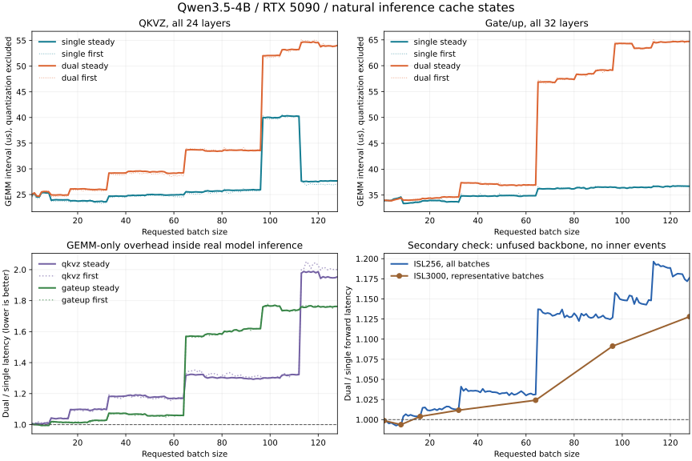

# Dual GEMM 对比 single：真实模型推理的自然缓存，BS=1–128

测量日期：2026-10-09。模型：Qwen3.5-4B，BF16 转换的 MXFP8 checkpoint；RTX 5090，测试 GPU。

排除量化时间，真实推理稳态下 QKVZ 的 GEMM 延迟几何平均变化为 **+27.3%**，gate/up 为 **+31.8%**。作为次要交叉验证，当前未融合路径移除投影内部计时节点后的完整 backbone 前向为 **+8.2%**。这里正数表示 dual 更慢；dual 的价值应由精度需求评估，不能把双路累加当作已验证的加速方案。



## 实际冷热计算的定义

本次用 vLLM 的完整生成过程建立缓存状态：真实 embedding、32 层模型、GDN/attention、MLP、KV cache、部署端 LM head 和采样均实际执行。投影直接接收模型中产生的 BF16 激活。没有随机激活，没有反复只回放同一权重，没有清空 L2，也没有在同一个投影处先执行一组再执行另一组。

`first` 是所有请求完成 prefill 后的第一个完整 batch decode 步；`steady` 是随后连续 decode，去掉前 3 步和最后 2 步。二者保留实际的缓存状态，但不代表硬件 L2 的全冷/全热端点。本次没有测量 L2 命中率。模型各层的权重工作集远大于 96 MiB L2，连续 decode 也不能等同于单权重驻留 L2 的 hot microbenchmark。

## 对照与测量边界（主比较只计 GEMM）

- 按用户的激活函数+量化融合计划，主比较排除量化，只使用量化完成后的 GEMM 区间；本次没有实现这项融合，完整前向数字不代表未来融合后的部署收益。
- 保持 `qwen35-4b-mxfp8-champion-v1` 的 runtime 补丁、GDN、BA/QKVZ 并行、KV FP8、编译和 Graph 策略一致。依赖版本与 runtime 源码 SHA256 校验均通过。
- single 使用部署端 `mxfp8_e4m3_quantize` 加普通 native GEMM；dual 使用 high/residual 两路量化加当前仓库原生 dual GEMM。两边 PDL 均关闭。
- 测量 hook 将 32 个 gate/up 和 24 个 QKVZ 在 M=1–128 切到对应实验 arm。发布的 champion 默认仍是 gate/up M32、QKVZ M32/M64；本次验证的是扩展路径，不表示线上默认策略已变更。
- 投影时间来自 CUDA Graph 内的 external CUDA events，真实 replay 会更新时间戳。逐步核对全部 56 个投影以及实际 M。
- 投影数字是事件包围的算子区间，包含内部计时节点的影响，并非 CUPTI 提取的纯 kernel duration；无内部计时节点的完整前向用于检查是否存在明显的计时观察效应，融合后的最终前向仍需在融合实现上测量。
- 另起两组生命周期，移除全部投影内部事件，仅在完整 Graph replay 外计时，交叉验证完整 backbone 性能。该时间不包含 LM head、采样、CPU 调度或 HTTP；这些步骤仍照常执行并影响下一步缓存。
- ISL256 全测 128 个请求 batch，OSL32；每点正向/反向各一次。各重复内先取稳态步的中位数，再对两次重复求平均。投影时间先对该类所有层取平均。
- ISL3000 补测实际长对话，OSL384，使 chunked prefill 后仍有足够的完整 batch decode 步。使用 7 个代表 batch，正向/反向各一次。
- ISL256 使用 62 条足够长的实际对话截取前缀；ISL3000 使用数据集唯一一条 3000-token 对话，独立请求重复使用，prefix cache 关闭。两组使用相同提示和采样参数，但生成 token 可以因数值路径不同而变化。

## 部署 Graph 与原生 M 的关系

请求 BS=1–128 在部署 profile 下映射到 19 个实际 M：1、2、4、8、16、24、…、128。例如 BS3→M4、BS33→M40。这是部署端 Graph padding；dual 内核自身直接接收实际 M，未额外复制、拆分或补齐。当前 native API 对每个整数 M=1–128 的支持与此前正确性测试保留；真实部署测量应按下表的实际 M 解读。

single 使用仓库现有的按形状 tactic dispatch，dual 在 M32 之后切换 tile family。配置切换会造成曲线跃变，特别是 QKVZ 的请求 BS97–112 与 BS113–128；本轮没有重新调优 single 或 dual 的 dispatch。

## 首步与稳态汇总

| 阶段 | QKVZ GEMM D/S | gate/up GEMM D/S | 无内部事件 backbone D/S |
|---|---:|---:|---:|
| prefill 后首个完整 batch decode | 1.279 | 1.317 | 1.083 |
| 连续 decode 稳态 | 1.273 | 1.318 | 1.082 |

## 不同 batch 范围

| 请求 BS 范围 | 稳态 QKVZ D/S | 稳态 gate/up D/S | 无内部事件 backbone D/S |
|---|---:|---:|---:|
| 1-32 | 1.060 | 1.013 | 1.007 |
| 33-64 | 1.180 | 1.064 | 1.034 |
| 65-128 | 1.448 | 1.673 | 1.148 |

## 代表点：稳态、自然缓存

GEMM 为单个投影的全层平均微秒，排除量化；backbone 为移除投影计时节点后的完整前向毫秒。

| 请求 BS | 实际 M | QKVZ single/dual μs | gate/up single/dual μs | backbone single/dual ms | backbone D/S |
|---:|---:|---:|---:|---:|---:|
| 1 | 1 | 24.84/25.03 | 33.91/34.00 | 3.643/3.640 | 0.999 |
| 2 | 2 | 25.24/25.33 | 33.98/33.96 | 3.771/3.763 | 0.998 |
| 4 | 4 | 24.53/24.67 | 33.95/33.88 | 3.795/3.780 | 0.996 |
| 8 | 8 | 25.33/25.51 | 34.61/34.43 | 4.173/4.143 | 0.993 |
| 16 | 16 | 23.98/24.90 | 33.66/34.14 | 4.342/4.361 | 1.004 |
| 24 | 24 | 23.75/26.03 | 33.96/34.44 | 4.525/4.587 | 1.014 |
| 32 | 32 | 23.63/25.93 | 33.67/34.65 | 4.796/4.862 | 1.014 |
| 40 | 40 | 24.66/29.21 | 34.77/37.31 | 5.277/5.465 | 1.035 |
| 48 | 48 | 24.83/29.53 | 34.76/37.14 | 5.621/5.810 | 1.034 |
| 64 | 64 | 24.94/29.23 | 34.87/36.96 | 6.133/6.325 | 1.031 |
| 80 | 80 | 25.64/33.45 | 36.21/57.34 | 6.980/7.902 | 1.132 |
| 96 | 96 | 25.93/33.56 | 36.52/59.12 | 7.652/8.623 | 1.127 |
| 112 | 112 | 40.24/53.23 | 36.46/63.47 | 8.562/9.830 | 1.148 |
| 128 | 128 | 27.65/54.03 | 36.71/64.69 | 8.963/10.544 | 1.176 |

## 3000-token 上下文：完整前向交叉验证

| 请求 BS | 实际 M | first single/dual ms | first D/S | steady single/dual ms | steady D/S |
|---:|---:|---:|---:|---:|---:|
| 1 | 1 | 3.692/3.688 | 0.999 | 3.653/3.648 | 0.999 |
| 8 | 8 | 4.389/4.345 | 0.990 | 4.364/4.336 | 0.994 |
| 16 | 16 | 4.727/4.730 | 1.001 | 4.776/4.795 | 1.004 |
| 32 | 32 | 5.566/5.637 | 1.013 | 5.692/5.758 | 1.012 |
| 64 | 64 | 7.705/7.898 | 1.025 | 7.894/8.084 | 1.024 |
| 96 | 96 | 10.174/11.129 | 1.094 | 10.412/11.363 | 1.091 |
| 128 | 128 | 12.360/13.986 | 1.132 | 12.638/14.256 | 1.128 |

## BS=1–128 全部结果

D/S=dual 延迟÷single 延迟，小于 1 才是 dual 更快。绝对延迟和 GEMM-only 分解见 CSV/JSON。

| BS | M | first QKVZ GEMM D/S | first gate/up GEMM D/S | steady QKVZ GEMM D/S | steady gate/up GEMM D/S | steady backbone D/S |
|---:|---:|---:|---:|---:|---:|---:|
| 1 | 1 | 1.005 | 1.003 | 1.008 | 1.003 | 0.999 |
| 2 | 2 | 1.006 | 1.007 | 1.003 | 1.000 | 0.998 |
| 3 | 4 | 1.018 | 1.005 | 1.008 | 1.000 | 0.995 |
| 4 | 4 | 1.019 | 1.005 | 1.006 | 0.998 | 0.996 |
| 5 | 8 | 1.011 | 0.999 | 1.005 | 0.994 | 0.994 |
| 6 | 8 | 1.011 | 0.995 | 1.008 | 0.995 | 0.993 |
| 7 | 8 | 1.016 | 0.994 | 1.011 | 0.995 | 0.994 |
| 8 | 8 | 1.015 | 0.997 | 1.007 | 0.995 | 0.993 |
| 9 | 16 | 1.040 | 1.013 | 1.043 | 1.019 | 1.004 |
| 10 | 16 | 1.039 | 1.014 | 1.040 | 1.019 | 1.007 |
| 11 | 16 | 1.039 | 1.018 | 1.038 | 1.017 | 1.005 |
| 12 | 16 | 1.039 | 1.015 | 1.041 | 1.016 | 1.006 |
| 13 | 16 | 1.042 | 1.011 | 1.041 | 1.016 | 1.005 |
| 14 | 16 | 1.040 | 1.010 | 1.038 | 1.014 | 1.004 |
| 15 | 16 | 1.042 | 1.013 | 1.039 | 1.015 | 1.004 |
| 16 | 16 | 1.045 | 1.017 | 1.038 | 1.014 | 1.004 |
| 17 | 24 | 1.095 | 1.015 | 1.098 | 1.014 | 1.015 |
| 18 | 24 | 1.090 | 1.017 | 1.097 | 1.012 | 1.015 |
| 19 | 24 | 1.089 | 1.016 | 1.097 | 1.014 | 1.012 |
| 20 | 24 | 1.096 | 1.020 | 1.099 | 1.013 | 1.011 |
| 21 | 24 | 1.099 | 1.011 | 1.099 | 1.012 | 1.012 |
| 22 | 24 | 1.087 | 1.012 | 1.098 | 1.014 | 1.013 |
| 23 | 24 | 1.092 | 1.015 | 1.098 | 1.015 | 1.012 |
| 24 | 24 | 1.107 | 1.012 | 1.096 | 1.014 | 1.014 |
| 25 | 32 | 1.088 | 1.009 | 1.091 | 1.023 | 1.013 |
| 26 | 32 | 1.081 | 1.028 | 1.094 | 1.024 | 1.015 |
| 27 | 32 | 1.101 | 1.028 | 1.100 | 1.028 | 1.016 |
| 28 | 32 | 1.099 | 1.023 | 1.098 | 1.028 | 1.016 |
| 29 | 32 | 1.102 | 1.023 | 1.101 | 1.027 | 1.014 |
| 30 | 32 | 1.104 | 1.028 | 1.096 | 1.026 | 1.013 |
| 31 | 32 | 1.102 | 1.025 | 1.101 | 1.027 | 1.013 |
| 32 | 32 | 1.107 | 1.028 | 1.097 | 1.029 | 1.014 |
| 33 | 40 | 1.193 | 1.060 | 1.182 | 1.074 | 1.041 |
| 34 | 40 | 1.187 | 1.072 | 1.182 | 1.073 | 1.036 |
| 35 | 40 | 1.179 | 1.070 | 1.183 | 1.073 | 1.038 |
| 36 | 40 | 1.170 | 1.075 | 1.181 | 1.073 | 1.035 |
| 37 | 40 | 1.174 | 1.068 | 1.182 | 1.073 | 1.036 |
| 38 | 40 | 1.168 | 1.073 | 1.182 | 1.071 | 1.036 |
| 39 | 40 | 1.177 | 1.071 | 1.183 | 1.073 | 1.036 |
| 40 | 40 | 1.185 | 1.070 | 1.185 | 1.073 | 1.035 |
| 41 | 48 | 1.190 | 1.064 | 1.189 | 1.067 | 1.034 |
| 42 | 48 | 1.176 | 1.069 | 1.191 | 1.066 | 1.038 |
| 43 | 48 | 1.180 | 1.064 | 1.186 | 1.067 | 1.034 |
| 44 | 48 | 1.183 | 1.059 | 1.192 | 1.068 | 1.035 |
| 45 | 48 | 1.183 | 1.063 | 1.190 | 1.068 | 1.035 |
| 46 | 48 | 1.176 | 1.070 | 1.191 | 1.067 | 1.034 |
| 47 | 48 | 1.172 | 1.069 | 1.186 | 1.065 | 1.034 |
| 48 | 48 | 1.185 | 1.069 | 1.189 | 1.069 | 1.034 |
| 49 | 56 | 1.166 | 1.059 | 1.180 | 1.057 | 1.032 |
| 50 | 56 | 1.179 | 1.057 | 1.175 | 1.056 | 1.033 |
| 51 | 56 | 1.164 | 1.056 | 1.177 | 1.058 | 1.033 |
| 52 | 56 | 1.171 | 1.056 | 1.179 | 1.056 | 1.034 |
| 53 | 56 | 1.165 | 1.056 | 1.177 | 1.057 | 1.030 |
| 54 | 56 | 1.175 | 1.053 | 1.179 | 1.058 | 1.033 |
| 55 | 56 | 1.176 | 1.056 | 1.181 | 1.058 | 1.031 |
| 56 | 56 | 1.169 | 1.053 | 1.182 | 1.056 | 1.032 |
| 57 | 64 | 1.167 | 1.047 | 1.173 | 1.062 | 1.033 |
| 58 | 64 | 1.162 | 1.058 | 1.169 | 1.061 | 1.035 |
| 59 | 64 | 1.153 | 1.060 | 1.169 | 1.061 | 1.033 |
| 60 | 64 | 1.172 | 1.055 | 1.171 | 1.060 | 1.030 |
| 61 | 64 | 1.163 | 1.055 | 1.168 | 1.060 | 1.032 |
| 62 | 64 | 1.168 | 1.064 | 1.172 | 1.059 | 1.032 |
| 63 | 64 | 1.176 | 1.056 | 1.168 | 1.059 | 1.031 |
| 64 | 64 | 1.165 | 1.057 | 1.172 | 1.060 | 1.031 |
| 65 | 72 | 1.329 | 1.562 | 1.319 | 1.570 | 1.137 |
| 66 | 72 | 1.343 | 1.577 | 1.321 | 1.569 | 1.137 |
| 67 | 72 | 1.346 | 1.567 | 1.325 | 1.572 | 1.133 |
| 68 | 72 | 1.348 | 1.562 | 1.324 | 1.571 | 1.132 |
| 69 | 72 | 1.354 | 1.565 | 1.320 | 1.570 | 1.132 |
| 70 | 72 | 1.338 | 1.566 | 1.322 | 1.571 | 1.132 |
| 71 | 72 | 1.350 | 1.566 | 1.323 | 1.569 | 1.129 |
| 72 | 72 | 1.329 | 1.562 | 1.324 | 1.569 | 1.130 |
| 73 | 80 | 1.315 | 1.580 | 1.307 | 1.581 | 1.131 |
| 74 | 80 | 1.315 | 1.582 | 1.300 | 1.586 | 1.131 |
| 75 | 80 | 1.333 | 1.573 | 1.304 | 1.585 | 1.137 |
| 76 | 80 | 1.326 | 1.580 | 1.306 | 1.583 | 1.127 |
| 77 | 80 | 1.329 | 1.577 | 1.303 | 1.584 | 1.129 |
| 78 | 80 | 1.324 | 1.586 | 1.300 | 1.581 | 1.127 |
| 79 | 80 | 1.298 | 1.584 | 1.303 | 1.587 | 1.128 |
| 80 | 80 | 1.322 | 1.588 | 1.305 | 1.584 | 1.132 |
| 81 | 88 | 1.309 | 1.599 | 1.303 | 1.602 | 1.129 |
| 82 | 88 | 1.330 | 1.600 | 1.300 | 1.599 | 1.123 |
| 83 | 88 | 1.336 | 1.603 | 1.301 | 1.603 | 1.132 |
| 84 | 88 | 1.328 | 1.608 | 1.303 | 1.600 | 1.129 |
| 85 | 88 | 1.317 | 1.606 | 1.302 | 1.610 | 1.131 |
| 86 | 88 | 1.310 | 1.609 | 1.301 | 1.612 | 1.128 |
| 87 | 88 | 1.322 | 1.603 | 1.302 | 1.604 | 1.126 |
| 88 | 88 | 1.319 | 1.601 | 1.303 | 1.606 | 1.127 |
| 89 | 96 | 1.304 | 1.615 | 1.298 | 1.616 | 1.131 |
| 90 | 96 | 1.309 | 1.620 | 1.297 | 1.617 | 1.127 |
| 91 | 96 | 1.307 | 1.620 | 1.296 | 1.620 | 1.127 |
| 92 | 96 | 1.303 | 1.608 | 1.296 | 1.620 | 1.129 |
| 93 | 96 | 1.315 | 1.618 | 1.293 | 1.618 | 1.126 |
| 94 | 96 | 1.310 | 1.620 | 1.296 | 1.619 | 1.125 |
| 95 | 96 | 1.316 | 1.619 | 1.297 | 1.619 | 1.125 |
| 96 | 96 | 1.312 | 1.623 | 1.294 | 1.619 | 1.127 |
| 97 | 104 | 1.295 | 1.770 | 1.301 | 1.759 | 1.158 |
| 98 | 104 | 1.300 | 1.754 | 1.301 | 1.767 | 1.155 |
| 99 | 104 | 1.301 | 1.777 | 1.300 | 1.768 | 1.150 |
| 100 | 104 | 1.304 | 1.767 | 1.301 | 1.765 | 1.149 |
| 101 | 104 | 1.302 | 1.762 | 1.304 | 1.766 | 1.148 |
| 102 | 104 | 1.301 | 1.770 | 1.302 | 1.770 | 1.148 |
| 103 | 104 | 1.312 | 1.764 | 1.304 | 1.764 | 1.154 |
| 104 | 104 | 1.298 | 1.761 | 1.301 | 1.765 | 1.153 |
| 105 | 112 | 1.314 | 1.736 | 1.319 | 1.735 | 1.144 |
| 106 | 112 | 1.329 | 1.740 | 1.322 | 1.737 | 1.151 |
| 107 | 112 | 1.326 | 1.737 | 1.317 | 1.738 | 1.145 |
| 108 | 112 | 1.309 | 1.730 | 1.320 | 1.733 | 1.144 |
| 109 | 112 | 1.324 | 1.738 | 1.323 | 1.737 | 1.143 |
| 110 | 112 | 1.322 | 1.729 | 1.323 | 1.741 | 1.143 |
| 111 | 112 | 1.318 | 1.738 | 1.321 | 1.737 | 1.149 |
| 112 | 112 | 1.331 | 1.744 | 1.323 | 1.741 | 1.148 |
| 113 | 120 | 1.999 | 1.764 | 1.978 | 1.760 | 1.196 |
| 114 | 120 | 2.006 | 1.767 | 1.988 | 1.756 | 1.192 |
| 115 | 120 | 2.052 | 1.768 | 1.983 | 1.757 | 1.193 |
| 116 | 120 | 2.036 | 1.766 | 1.988 | 1.765 | 1.190 |
| 117 | 120 | 2.008 | 1.765 | 1.983 | 1.767 | 1.191 |
| 118 | 120 | 2.040 | 1.759 | 1.989 | 1.759 | 1.190 |
| 119 | 120 | 2.044 | 1.768 | 1.980 | 1.759 | 1.189 |
| 120 | 120 | 2.026 | 1.768 | 1.987 | 1.764 | 1.189 |
| 121 | 128 | 1.997 | 1.760 | 1.943 | 1.759 | 1.178 |
| 122 | 128 | 2.016 | 1.763 | 1.955 | 1.761 | 1.180 |
| 123 | 128 | 2.011 | 1.758 | 1.949 | 1.758 | 1.181 |
| 124 | 128 | 1.998 | 1.765 | 1.954 | 1.760 | 1.181 |
| 125 | 128 | 2.006 | 1.765 | 1.949 | 1.762 | 1.181 |
| 126 | 128 | 2.000 | 1.751 | 1.947 | 1.760 | 1.174 |
| 127 | 128 | 2.003 | 1.763 | 1.948 | 1.763 | 1.172 |
| 128 | 128 | 1.999 | 1.764 | 1.954 | 1.762 | 1.176 |

## 对当前实现的判断

当前 dual 已原生支持 M=1–128，但范围扩展没有使所有 M 都成为高效配置。M>32 沿用 128×32×128 的两阶段双累加器 tile family；两路 MMA 和双 accumulator 的资源成本仍然存在。测量显示较小 batch 可以用较低的 GEMM 代价采用双路表示，较大 batch 的计算代价显著增加。仅融合激活函数和量化会移除前置开销，不会自动消除本报告已经排除量化后的 GEMM 差距。若目标是加速，应继续针对较大 M 调整 dual 的 tile/资源配置，再在同样的实际推理位置验证；本次不能据此给出全范围默认启用的性能理由。

## 证据和复现

- [全部延迟 CSV](../benchmarks/results/mxfp8_dual_actual_inference_bs1_128.csv)、[结果和环境 JSON](../benchmarks/results/mxfp8_dual_actual_inference_bs1_128.json)、[曲线](mxfp8-dual-actual-inference.svg)。
- native 实现：`mxfp6_sm120/python/mxfp6/mxfp8_dual.py`；完整推理 harness：`benchmarks/benchmark_mxfp8_dual_inference.py`；覆盖检查和汇总：`benchmarks/report_mxfp8_dual_inference.py`。
- 本机原始逐步/逐层数据、生成 token、部署 worker receipt、runtime 源码校验、隔离环境身份均在 `${AUDIT_ROOT}/`。有效运行目录：`single-v2`、`dual`、`dual-forward`、`single-forward`。
- 从 vllm0.29.0 和 b12x1.2.6 wheel 解压到独立 site，复制 main06a08a3 的 `vllm_mach`，使用 `mxfp8.install.install_profile` 应用已校验 runtime 补丁。未改全局 vLLM 或正在运行的服务。
- 隔离 profile 的 `install_worker_hook` 调用测量脚本的 `install_measurement()`，再执行原 profile hook，最后 `wrap_worker()`。单独启动进程，设置 `MX8_INFERENCE_ARM=single/dual`；完整前向验证设置 `MX8_INFERENCE_EVENTS=0`。
- 所有运行使用同一测试 GPU；未锁频。每组内部采用相反 batch 顺序复测。数据是该模型、GPU、runtime 和提示集合的测量，不是跨模型或整服务吞吐结论。
- 之前人工 hot/evicted cold 的报告仅解释内核端点；部署结论以本报告的自然缓存结果为准。

隔离环境准备完成后，以同一 GPU 分别运行两个 arm：

```bash
CUDA_VISIBLE_DEVICES="${GPU_ID}" \
MXFP8_LIBRARY_PATH="${KERNEL_ROOT}/build/mxfp8/mxfp8_torch.so" \
PYTHONPATH="${AUDIT_ROOT}/site:${KERNEL_ROOT}/python:${KERNEL_ROOT}/benchmarks" \
"${RUNTIME_PYTHON}" \
  benchmarks/benchmark_mxfp8_dual_inference.py --arm single \
  --model "${MODEL_DIR}" --prompts "${PROMPTS_FILE}" \
  --output "${AUDIT_ROOT}/new-single" \
  --repeats 2 --output-tokens 32
```

将 `--arm single` 改为 `dual` 并使用不同输出目录即可测另一组。完整前向验证添加环境变量 `MX8_INFERENCE_EVENTS=0` 和参数 `--extra-context 3000`。

复现命令中的变量按本地环境设置：`KERNEL_ROOT` 为内核仓库，`RUNTIME_ROOT` 为对应 runtime 源码，`RUNTIME_PYTHON` 为其 Python 环境，`MODEL_DIR` 为模型目录，`AUDIT_ROOT` 为本地审计目录，`PROMPTS_FILE` 为提示 JSON，`GPU_ID` 为测试设备编号。公开报告不包含原始提示、生成内容或私有权重；路径和设备标识已脱敏，内容哈希对应原始测量文件。
