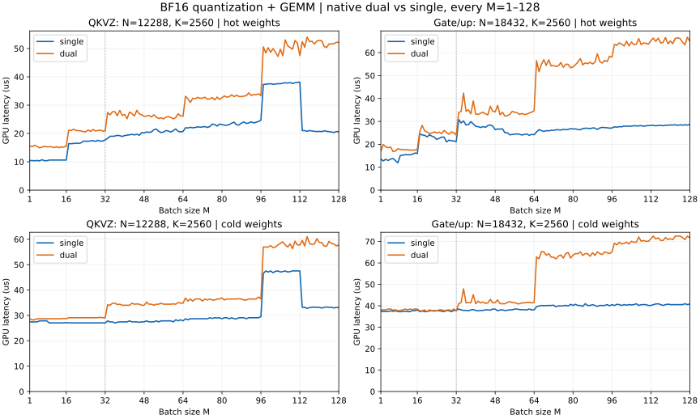
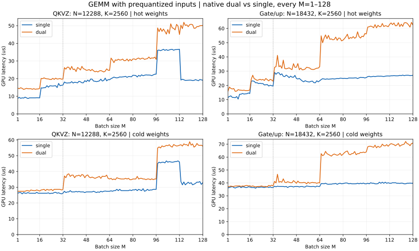

> 本文是合成激活、人工 hot/evicted cold 的 microbenchmark。真实模型推理、自然缓存的 GEMM-only 结果见 [新报告](mxfp8-dual-actual-inference.md)。

# Native dual GEMM 与 single：bs=1–128 完整对比

日期：2026-10-08。只测算子，不测服务。

## 原生支持范围

两个投影都支持每一个整数 **bs=1–128**：QKVZ `(N,K)=(12288,2560)`、gate/up `(N,K)=(18432,2560)`。每次只有一个原生 dual GEMM，传入实际 M；没有把输入补到32/64、额外 copy、分块串联多个 GEMM 或回退 single。

M≤32 保留原32 kernel的tile/算术；M33–128 使用128×32×128双阶段TMA、scale寄存器流水线，同时支持两个N。尾块值由TMA边界填零，非法行scale读取和输出store有mask。量化器也接受实际M，scale存储仍按128行布局补齐，这是E8M0存储格式要求。

## 实测结论

dual 的主要收益是更小的激活量化误差。本轮没有证明它能提升算子吞吐；hot weights下通常比single慢，cold weights下小batch的gate/up接近single，大batch额外开销明显。下表为全部128个bs的 D/S 时延比几何均值。**D/S>1 表示dual更慢，1.20表示时延增加20%**。

| 投影 | 纯GEMM hot D/S | 纯GEMM cold D/S | 量化+GEMM hot D/S | 量化+GEMM cold D/S |
|---|---:|---:|---:|---:|
| QKVZ | 1.507× | 1.276× | 1.462× | 1.250× |
| gate/up | 1.684× | 1.326× | 1.643× | 1.326× |

| 投影 | single relative L2 | dual relative L2 | 误差改善倍数 |
|---|---:|---:|---:|
| QKVZ | 2.670% | 0.166% | 16.10× |
| gate/up | 2.669% | 0.166% | 16.10× |

误差为128个bs的中位数。参考是BF16输入对应的FP32 GEMM，使用同一份反量化MXFP8权重，TF32关闭；衡量激活近似和BF16输出舍入，不包含原始BF16权重转MXFP8的误差。

## 性能曲线

量化+GEMM：



纯GEMM：



32处虚线标记dual kernel family切换；single使用现有M区间dispatch，曲线不必随bs单调变化。

## 每个 bs 的完整时延表

单位µs，`S / D`依次为single/dual。纯GEMM不计激活量化；量化+GEMM从BF16输入开始。每个数是9轮试验平均值的中位数。CSV还包含纯GEMM cold和逐点误差，JSON包含全部原始样本。

### QKVZ：N12288/K2560

| bs | 纯GEMM hot S / D | 量化+GEMM hot S / D | hot D/S | 量化+GEMM cold S / D | cold D/S |
|---:|---:|---:|---:|---:|---:|
| 1 | 8.87 / 14.55 | 10.48 / 15.59 | 1.487× | 27.44 / 28.67 | 1.045× |
| 2 | 9.35 / 14.33 | 10.42 / 15.36 | 1.475× | 27.44 / 28.26 | 1.030× |
| 3 | 8.83 / 14.83 | 10.37 / 15.84 | 1.528× | 27.44 / 28.26 | 1.030× |
| 4 | 9.09 / 14.46 | 10.46 / 15.50 | 1.481× | 27.44 / 28.68 | 1.045× |
| 5 | 8.97 / 13.88 | 10.31 / 14.92 | 1.447× | 27.85 / 28.67 | 1.029× |
| 6 | 9.47 / 14.17 | 10.74 / 15.16 | 1.411× | 27.85 / 28.67 | 1.029× |
| 7 | 9.09 / 14.49 | 10.39 / 15.50 | 1.491× | 27.85 / 28.67 | 1.029× |
| 8 | 8.70 / 14.25 | 10.37 / 15.27 | 1.473× | 27.85 / 28.67 | 1.029× |
| 9 | 9.09 / 14.24 | 10.61 / 15.29 | 1.440× | 27.03 / 28.67 | 1.061× |
| 10 | 9.09 / 14.26 | 10.61 / 15.32 | 1.443× | 27.03 / 28.67 | 1.061× |
| 11 | 9.09 / 13.97 | 10.62 / 15.00 | 1.413× | 27.03 / 28.68 | 1.061× |
| 12 | 9.09 / 14.30 | 10.62 / 15.33 | 1.443× | 27.03 / 28.67 | 1.061× |
| 13 | 9.10 / 13.96 | 10.62 / 14.99 | 1.411× | 27.03 / 28.67 | 1.061× |
| 14 | 9.16 / 14.14 | 10.64 / 15.24 | 1.431× | 27.03 / 28.67 | 1.061× |
| 15 | 9.14 / 14.13 | 10.62 / 15.21 | 1.431× | 27.03 / 28.81 | 1.066× |
| 16 | 9.09 / 14.45 | 10.63 / 15.53 | 1.462× | 27.17 / 28.67 | 1.055× |
| 17 | 14.74 / 20.08 | 16.42 / 21.14 | 1.287× | 27.04 / 29.08 | 1.075× |
| 18 | 14.67 / 19.97 | 16.39 / 21.06 | 1.285× | 27.03 / 29.08 | 1.076× |
| 19 | 14.85 / 20.44 | 16.46 / 21.49 | 1.305× | 27.03 / 29.08 | 1.076× |
| 20 | 14.90 / 20.03 | 16.59 / 21.11 | 1.272× | 27.03 / 29.08 | 1.076× |
| 21 | 15.99 / 19.89 | 16.48 / 20.98 | 1.273× | 27.03 / 29.08 | 1.076× |
| 22 | 15.14 / 19.81 | 16.66 / 20.91 | 1.255× | 27.03 / 29.08 | 1.076× |
| 23 | 15.93 / 19.55 | 17.29 / 20.64 | 1.194× | 27.03 / 29.08 | 1.076× |
| 24 | 15.87 / 19.48 | 17.27 / 20.58 | 1.191× | 27.03 / 29.09 | 1.076× |
| 25 | 15.79 / 20.14 | 17.27 / 21.24 | 1.230× | 27.03 / 29.08 | 1.076× |
| 26 | 15.87 / 19.57 | 17.35 / 20.72 | 1.194× | 27.03 / 29.08 | 1.076× |
| 27 | 15.97 / 20.25 | 17.49 / 21.41 | 1.224× | 27.03 / 29.08 | 1.076× |
| 28 | 14.94 / 19.75 | 17.20 / 20.90 | 1.215× | 27.03 / 29.08 | 1.076× |
| 29 | 17.27 / 19.88 | 17.60 / 21.03 | 1.195× | 27.03 / 29.08 | 1.076× |
| 30 | 15.99 / 20.04 | 17.27 / 21.20 | 1.228× | 27.03 / 29.23 | 1.081× |
| 31 | 16.21 / 19.67 | 17.36 / 20.82 | 1.199× | 27.03 / 29.08 | 1.076× |
| 32 | 16.36 / 19.75 | 17.72 / 20.90 | 1.179× | 27.03 / 29.08 | 1.076× |
| 33 | 18.08 / 26.21 | 18.27 / 27.40 | 1.500× | 27.81 / 34.20 | 1.230× |
| 34 | 17.57 / 25.37 | 19.02 / 26.54 | 1.395× | 27.44 / 34.00 | 1.239× |
| 35 | 17.49 / 26.51 | 19.00 / 27.71 | 1.459× | 27.45 / 34.80 | 1.268× |
| 36 | 17.59 / 26.45 | 19.11 / 27.67 | 1.448× | 27.04 / 34.82 | 1.288× |
| 37 | 17.60 / 25.06 | 19.33 / 26.26 | 1.359× | 27.32 / 34.28 | 1.255× |
| 38 | 18.28 / 26.92 | 19.21 / 28.13 | 1.465× | 27.44 / 34.41 | 1.254× |
| 39 | 17.49 / 25.12 | 18.96 / 26.37 | 1.390× | 27.44 / 34.00 | 1.239× |
| 40 | 17.96 / 25.46 | 19.25 / 26.72 | 1.388× | 27.44 / 34.00 | 1.239× |
| 41 | 17.82 / 24.00 | 19.42 / 25.21 | 1.298× | 27.44 / 34.00 | 1.239× |
| 42 | 17.60 / 26.30 | 19.52 / 27.57 | 1.412× | 27.85 / 34.00 | 1.221× |
| 43 | 18.47 / 25.78 | 19.67 / 27.01 | 1.374× | 27.44 / 34.81 | 1.268× |
| 44 | 18.20 / 24.88 | 19.50 / 26.18 | 1.342× | 27.44 / 34.41 | 1.254× |
| 45 | 17.64 / 26.95 | 19.72 / 28.17 | 1.429× | 27.44 / 34.53 | 1.258× |
| 46 | 17.63 / 25.62 | 19.37 / 26.92 | 1.390× | 27.29 / 34.41 | 1.261× |
| 47 | 18.83 / 25.33 | 20.28 / 26.63 | 1.313× | 27.44 / 34.00 | 1.239× |
| 48 | 18.25 / 24.72 | 20.22 / 26.04 | 1.288× | 27.44 / 34.00 | 1.239× |
| 49 | 19.18 / 24.83 | 20.52 / 26.15 | 1.274× | 27.85 / 35.22 | 1.264× |
| 50 | 18.41 / 25.12 | 20.40 / 26.41 | 1.295× | 27.44 / 34.41 | 1.254× |
| 51 | 19.76 / 24.45 | 20.54 / 25.79 | 1.255× | 27.44 / 34.41 | 1.254× |
| 52 | 19.70 / 25.24 | 21.32 / 26.60 | 1.247× | 27.44 / 34.00 | 1.239× |
| 53 | 18.61 / 24.43 | 21.57 / 25.79 | 1.196× | 27.85 / 34.41 | 1.235× |
| 54 | 18.51 / 23.89 | 20.77 / 25.27 | 1.217× | 27.44 / 34.41 | 1.254× |
| 55 | 18.29 / 24.19 | 20.34 / 25.56 | 1.257× | 27.85 / 34.82 | 1.250× |
| 56 | 18.44 / 23.76 | 20.52 / 25.16 | 1.226× | 27.85 / 34.41 | 1.235× |
| 57 | 18.71 / 24.36 | 21.06 / 25.78 | 1.224× | 27.85 / 34.41 | 1.236× |
| 58 | 19.66 / 24.56 | 20.84 / 25.98 | 1.247× | 27.85 / 34.41 | 1.235× |
| 59 | 18.63 / 24.20 | 20.51 / 25.62 | 1.250× | 27.85 / 34.41 | 1.236× |
| 60 | 18.95 / 23.77 | 21.01 / 25.19 | 1.199× | 27.45 / 34.54 | 1.258× |
| 61 | 20.28 / 24.20 | 21.59 / 25.64 | 1.188× | 28.26 / 34.41 | 1.218× |
| 62 | 18.74 / 25.52 | 20.77 / 26.97 | 1.299× | 27.85 / 35.10 | 1.260× |
| 63 | 19.41 / 24.76 | 20.56 / 26.20 | 1.274× | 28.26 / 34.82 | 1.232× |
| 64 | 19.37 / 24.67 | 20.72 / 26.12 | 1.260× | 27.85 / 34.82 | 1.250× |
| 65 | 19.96 / 31.64 | 22.00 / 33.16 | 1.507× | 28.67 / 36.86 | 1.286× |
| 66 | 20.41 / 30.53 | 21.96 / 32.24 | 1.468× | 28.26 / 35.64 | 1.261× |
| 67 | 20.86 / 29.07 | 22.16 / 30.96 | 1.397× | 28.67 / 36.45 | 1.271× |
| 68 | 20.56 / 30.63 | 22.00 / 32.43 | 1.474× | 28.67 / 35.63 | 1.243× |
| 69 | 20.44 / 30.36 | 22.12 / 32.26 | 1.458× | 28.67 / 36.45 | 1.271× |
| 70 | 20.60 / 31.00 | 22.36 / 32.74 | 1.464× | 28.67 / 36.45 | 1.271× |
| 71 | 20.97 / 30.55 | 22.20 / 32.43 | 1.461× | 28.68 / 36.45 | 1.271× |
| 72 | 20.87 / 30.63 | 22.30 / 32.45 | 1.455× | 28.67 / 35.63 | 1.243× |
| 73 | 21.00 / 31.08 | 22.43 / 32.80 | 1.462× | 28.67 / 36.46 | 1.272× |
| 74 | 21.07 / 30.14 | 22.12 / 32.09 | 1.451× | 28.67 / 36.04 | 1.257× |
| 75 | 21.29 / 30.24 | 22.44 / 32.23 | 1.436× | 29.08 / 36.46 | 1.254× |
| 76 | 20.71 / 31.10 | 23.32 / 32.69 | 1.402× | 28.79 / 36.04 | 1.252× |
| 77 | 21.17 / 29.95 | 23.16 / 31.85 | 1.375× | 29.08 / 36.04 | 1.239× |
| 78 | 21.15 / 30.92 | 22.62 / 32.84 | 1.452× | 28.97 / 36.45 | 1.258× |
| 79 | 21.00 / 30.17 | 23.31 / 32.04 | 1.374× | 29.08 / 36.45 | 1.254× |
| 80 | 21.88 / 31.15 | 23.16 / 32.64 | 1.409× | 28.67 / 36.86 | 1.285× |
| 81 | 21.85 / 31.15 | 22.93 / 33.25 | 1.450× | 29.08 / 36.04 | 1.239× |
| 82 | 21.78 / 30.76 | 22.90 / 32.84 | 1.434× | 29.08 / 36.45 | 1.254× |
| 83 | 20.93 / 31.39 | 23.14 / 33.00 | 1.426× | 28.67 / 36.45 | 1.271× |
| 84 | 21.87 / 31.68 | 23.64 / 33.67 | 1.424× | 29.08 / 36.45 | 1.254× |
| 85 | 21.35 / 31.02 | 24.00 / 33.00 | 1.375× | 28.67 / 36.45 | 1.271× |
| 86 | 22.15 / 31.50 | 23.03 / 33.52 | 1.455× | 28.67 / 36.45 | 1.271× |
| 87 | 21.63 / 31.57 | 23.01 / 33.06 | 1.437× | 29.08 / 36.57 | 1.258× |
| 88 | 21.93 / 30.89 | 23.67 / 33.03 | 1.395× | 29.08 / 36.45 | 1.254× |
| 89 | 22.12 / 31.17 | 24.07 / 33.21 | 1.380× | 29.08 / 36.04 | 1.239× |
| 90 | 22.04 / 31.33 | 23.53 / 33.34 | 1.417× | 28.67 / 36.04 | 1.257× |
| 91 | 22.05 / 32.25 | 23.72 / 34.33 | 1.447× | 29.08 / 36.45 | 1.254× |
| 92 | 21.96 / 31.32 | 24.10 / 33.43 | 1.387× | 29.08 / 36.45 | 1.254× |
| 93 | 21.69 / 31.76 | 23.74 / 33.78 | 1.423× | 29.08 / 36.46 | 1.254× |
| 94 | 22.12 / 31.61 | 23.94 / 33.66 | 1.406× | 29.08 / 36.45 | 1.254× |
| 95 | 22.48 / 32.16 | 24.23 / 33.99 | 1.403× | 29.08 / 37.27 | 1.282× |
| 96 | 22.56 / 30.92 | 24.68 / 33.39 | 1.353× | 29.49 / 36.45 | 1.236× |
| 97 | 36.07 / 48.73 | 37.30 / 50.59 | 1.356× | 46.53 / 56.95 | 1.224× |
| 98 | 36.17 / 46.65 | 37.37 / 48.44 | 1.296× | 47.51 / 56.94 | 1.198× |
| 99 | 35.84 / 48.51 | 37.50 / 50.27 | 1.340× | 47.10 / 56.95 | 1.209× |
| 100 | 36.21 / 46.79 | 37.57 / 48.68 | 1.296× | 47.51 / 57.48 | 1.210× |
| 101 | 36.62 / 48.10 | 37.38 / 49.96 | 1.337× | 46.82 / 56.73 | 1.212× |
| 102 | 36.02 / 46.83 | 37.46 / 48.68 | 1.300× | 47.40 / 56.95 | 1.201× |
| 103 | 36.45 / 45.24 | 37.57 / 47.21 | 1.257× | 47.51 / 57.78 | 1.216× |
| 104 | 35.99 / 47.83 | 37.56 / 49.75 | 1.324× | 47.10 / 58.38 | 1.239× |
| 105 | 36.28 / 45.48 | 37.76 / 47.44 | 1.256× | 47.28 / 59.00 | 1.248× |
| 106 | 36.51 / 51.05 | 37.90 / 53.05 | 1.400× | 47.49 / 57.77 | 1.216× |
| 107 | 36.60 / 48.81 | 37.79 / 50.97 | 1.349× | 47.10 / 56.95 | 1.209× |
| 108 | 36.09 / 48.49 | 37.99 / 50.36 | 1.325× | 47.26 / 58.19 | 1.231× |
| 109 | 36.44 / 47.64 | 37.64 / 49.73 | 1.321× | 47.55 / 56.28 | 1.184× |
| 110 | 36.47 / 50.75 | 37.91 / 52.83 | 1.394× | 47.53 / 59.27 | 1.247× |
| 111 | 36.55 / 49.77 | 38.00 / 51.88 | 1.366× | 47.51 / 57.77 | 1.216× |
| 112 | 36.62 / 45.03 | 38.16 / 47.51 | 1.245× | 47.51 / 57.77 | 1.216× |
| 113 | 19.23 / 50.30 | 21.00 / 52.44 | 2.497× | 33.18 / 59.58 | 1.796× |
| 114 | 19.63 / 48.35 | 21.00 / 50.48 | 2.403× | 33.18 / 57.36 | 1.729× |
| 115 | 19.34 / 51.92 | 20.77 / 54.03 | 2.602× | 32.77 / 61.05 | 1.863× |
| 116 | 18.98 / 50.18 | 21.05 / 52.42 | 2.491× | 33.11 / 58.31 | 1.761× |
| 117 | 19.02 / 50.49 | 20.86 / 52.56 | 2.519× | 33.18 / 57.89 | 1.745× |
| 118 | 19.08 / 49.46 | 20.76 / 51.58 | 2.485× | 33.29 / 58.18 | 1.748× |
| 119 | 19.14 / 50.62 | 20.67 / 52.65 | 2.548× | 33.18 / 60.24 | 1.816× |
| 120 | 19.11 / 50.80 | 20.74 / 52.85 | 2.548× | 33.18 / 58.73 | 1.770× |
| 121 | 18.88 / 50.58 | 20.65 / 52.76 | 2.555× | 32.90 / 58.70 | 1.784× |
| 122 | 19.00 / 48.52 | 20.92 / 50.71 | 2.424× | 33.18 / 57.36 | 1.728× |
| 123 | 19.41 / 48.63 | 20.76 / 50.37 | 2.427× | 33.31 / 57.21 | 1.717× |
| 124 | 19.12 / 49.51 | 20.64 / 51.64 | 2.502× | 33.18 / 59.19 | 1.784× |
| 125 | 18.81 / 49.51 | 20.53 / 51.62 | 2.515× | 33.18 / 58.31 | 1.758× |
| 126 | 19.47 / 49.97 | 20.35 / 51.67 | 2.539× | 32.92 / 58.18 | 1.767× |
| 127 | 19.30 / 50.07 | 20.67 / 52.18 | 2.525× | 33.18 / 57.37 | 1.729× |
| 128 | 19.06 / 50.11 | 20.62 / 52.20 | 2.531× | 33.03 / 57.77 | 1.749× |

### gate/up：N18432/K2560

| bs | 纯GEMM hot S / D | 量化+GEMM hot S / D | hot D/S | 量化+GEMM cold S / D | cold D/S |
|---:|---:|---:|---:|---:|---:|
| 1 | 11.52 / 16.00 | 13.52 / 17.08 | 1.263× | 37.57 / 38.09 | 1.014× |
| 2 | 12.25 / 18.83 | 12.75 / 19.86 | 1.558× | 37.27 / 38.09 | 1.022× |
| 3 | 12.65 / 17.88 | 13.45 / 18.91 | 1.406× | 37.40 / 38.09 | 1.018× |
| 4 | 11.59 / 17.48 | 12.94 / 18.53 | 1.432× | 37.28 / 38.50 | 1.033× |
| 5 | 11.53 / 17.80 | 13.50 / 18.84 | 1.396× | 37.68 / 38.50 | 1.022× |
| 6 | 11.37 / 15.82 | 13.82 / 16.89 | 1.222× | 37.41 / 37.96 | 1.015× |
| 7 | 12.17 / 16.02 | 12.90 / 17.04 | 1.322× | 37.68 / 38.09 | 1.011× |
| 8 | 10.44 / 17.02 | 11.90 / 18.06 | 1.518× | 37.27 / 37.68 | 1.011× |
| 9 | 13.79 / 16.71 | 15.08 / 17.75 | 1.177× | 37.27 / 37.91 | 1.017× |
| 10 | 13.83 / 16.61 | 15.20 / 17.69 | 1.164× | 37.27 / 38.09 | 1.022× |
| 11 | 14.34 / 16.47 | 15.47 / 17.54 | 1.134× | 37.51 / 38.50 | 1.026× |
| 12 | 13.94 / 16.63 | 15.46 / 17.70 | 1.145× | 37.29 / 38.10 | 1.022× |
| 13 | 14.09 / 16.36 | 15.41 / 17.42 | 1.130× | 37.27 / 38.50 | 1.033× |
| 14 | 14.17 / 16.37 | 15.68 / 17.45 | 1.113× | 37.73 / 38.22 | 1.013× |
| 15 | 14.68 / 16.41 | 16.19 / 17.45 | 1.077× | 37.68 / 38.50 | 1.022× |
| 16 | 14.34 / 16.82 | 15.99 / 17.88 | 1.118× | 38.09 / 38.49 | 1.010× |
| 17 | 22.99 / 24.31 | 24.53 / 25.44 | 1.037× | 37.27 / 37.61 | 1.009× |
| 18 | 23.15 / 27.13 | 24.07 / 28.24 | 1.173× | 37.54 / 37.68 | 1.004× |
| 19 | 22.86 / 24.75 | 23.92 / 25.88 | 1.082× | 37.28 / 38.09 | 1.022× |
| 20 | 21.85 / 24.22 | 23.24 / 25.34 | 1.090× | 37.27 / 37.27 | 1.000× |
| 21 | 21.88 / 23.50 | 24.12 / 24.61 | 1.020× | 37.68 / 38.09 | 1.011× |
| 22 | 21.28 / 23.86 | 23.56 / 24.97 | 1.060× | 37.68 / 37.54 | 0.996× |
| 23 | 21.47 / 24.28 | 23.12 / 25.40 | 1.099× | 37.55 / 37.81 | 1.007× |
| 24 | 21.28 / 23.84 | 22.11 / 24.96 | 1.129× | 37.68 / 37.68 | 1.000× |
| 25 | 21.29 / 24.17 | 22.60 / 25.26 | 1.118× | 37.68 / 38.09 | 1.011× |
| 26 | 20.32 / 23.46 | 23.14 / 24.63 | 1.064× | 37.50 / 38.09 | 1.016× |
| 27 | 20.45 / 24.84 | 23.11 / 26.03 | 1.126× | 37.28 / 37.68 | 1.011× |
| 28 | 20.61 / 24.01 | 21.03 / 25.20 | 1.198× | 37.82 / 37.97 | 1.004× |
| 29 | 19.57 / 23.17 | 21.83 / 24.36 | 1.116× | 37.68 / 38.09 | 1.011× |
| 30 | 20.09 / 24.23 | 21.54 / 25.41 | 1.180× | 37.27 / 37.68 | 1.011× |
| 31 | 19.80 / 23.82 | 21.46 / 24.98 | 1.164× | 37.83 / 38.50 | 1.018× |
| 32 | 19.51 / 22.89 | 21.16 / 24.06 | 1.137× | 37.82 / 37.68 | 0.996× |
| 33 | 29.15 / 32.69 | 30.83 / 33.88 | 1.099× | 38.50 / 40.96 | 1.064× |
| 34 | 27.81 / 33.14 | 29.31 / 34.33 | 1.172× | 38.09 / 41.53 | 1.090× |
| 35 | 28.85 / 41.09 | 30.19 / 42.32 | 1.402× | 37.84 / 47.92 | 1.267× |
| 36 | 28.85 / 33.12 | 28.43 / 34.39 | 1.210× | 37.86 / 41.37 | 1.093× |
| 37 | 27.38 / 33.83 | 28.58 / 35.08 | 1.227× | 37.68 / 41.50 | 1.101× |
| 38 | 28.13 / 32.04 | 29.86 / 33.28 | 1.114× | 38.09 / 41.37 | 1.086× |
| 39 | 26.41 / 37.74 | 28.93 / 38.91 | 1.345× | 38.26 / 45.18 | 1.181× |
| 40 | 26.19 / 31.87 | 27.83 / 33.15 | 1.191× | 37.81 / 40.96 | 1.083× |
| 41 | 27.22 / 31.65 | 27.69 / 33.06 | 1.194× | 37.68 / 42.19 | 1.120× |
| 42 | 26.48 / 31.96 | 27.30 / 33.55 | 1.229× | 37.82 / 41.36 | 1.094× |
| 43 | 25.46 / 32.32 | 27.72 / 34.00 | 1.226× | 37.86 / 41.78 | 1.104× |
| 44 | 26.50 / 31.61 | 27.40 / 33.25 | 1.213× | 38.09 / 41.09 | 1.079× |
| 45 | 25.80 / 31.07 | 28.15 / 32.85 | 1.167× | 38.09 / 41.37 | 1.086× |
| 46 | 25.72 / 35.24 | 28.45 / 36.58 | 1.286× | 37.96 / 43.01 | 1.133× |
| 47 | 27.03 / 32.71 | 27.94 / 34.49 | 1.235× | 38.50 / 41.37 | 1.074× |
| 48 | 24.85 / 32.75 | 26.41 / 34.13 | 1.292× | 38.45 / 41.47 | 1.078× |
| 49 | 24.51 / 35.34 | 26.69 / 36.96 | 1.385× | 37.68 / 42.73 | 1.134× |
| 50 | 24.90 / 31.04 | 26.59 / 32.87 | 1.236× | 38.07 / 40.97 | 1.076× |
| 51 | 24.02 / 32.16 | 26.75 / 33.96 | 1.269× | 38.09 / 40.96 | 1.075× |
| 52 | 23.11 / 30.92 | 25.03 / 32.30 | 1.291× | 37.78 / 40.95 | 1.084× |
| 53 | 22.53 / 31.06 | 25.06 / 32.49 | 1.297× | 37.93 / 41.54 | 1.095× |
| 54 | 23.30 / 31.50 | 24.10 / 33.03 | 1.371× | 38.10 / 41.98 | 1.102× |
| 55 | 22.81 / 32.71 | 24.29 / 34.36 | 1.415× | 38.09 / 41.50 | 1.090× |
| 56 | 22.52 / 32.52 | 24.43 / 34.01 | 1.392× | 38.50 / 41.50 | 1.078× |
| 57 | 22.39 / 32.26 | 24.52 / 33.78 | 1.378× | 38.50 / 40.96 | 1.064× |
| 58 | 22.87 / 31.44 | 24.38 / 33.00 | 1.353× | 38.20 / 40.96 | 1.072× |
| 59 | 23.01 / 31.18 | 24.03 / 33.46 | 1.392× | 38.22 / 41.37 | 1.082× |
| 60 | 21.93 / 31.18 | 24.31 / 33.00 | 1.357× | 38.09 / 41.37 | 1.086× |
| 61 | 21.84 / 31.63 | 24.49 / 33.17 | 1.354× | 38.09 / 41.59 | 1.092× |
| 62 | 23.24 / 32.09 | 23.91 / 33.65 | 1.408× | 38.48 / 41.60 | 1.081× |
| 63 | 22.49 / 32.15 | 24.33 / 34.03 | 1.398× | 38.09 / 41.37 | 1.086× |
| 64 | 23.25 / 33.14 | 24.15 / 34.62 | 1.433× | 38.09 / 41.50 | 1.089× |
| 65 | 24.07 / 54.78 | 25.39 / 56.49 | 2.225× | 39.60 / 62.80 | 1.586× |
| 66 | 24.72 / 49.92 | 26.37 / 51.67 | 1.959× | 39.88 / 61.87 | 1.551× |
| 67 | 24.50 / 53.22 | 25.99 / 54.87 | 2.111× | 40.14 / 65.27 | 1.626× |
| 68 | 24.28 / 55.42 | 25.59 / 56.90 | 2.223× | 40.04 / 65.15 | 1.627× |
| 69 | 24.58 / 52.79 | 25.94 / 54.38 | 2.096× | 40.13 / 63.64 | 1.586× |
| 70 | 24.33 / 55.10 | 25.87 / 56.85 | 2.198× | 40.14 / 64.33 | 1.603× |
| 71 | 24.44 / 52.38 | 26.10 / 54.19 | 2.076× | 40.14 / 62.69 | 1.562× |
| 72 | 24.54 / 52.64 | 26.08 / 54.36 | 2.084× | 40.28 / 62.69 | 1.556× |
| 73 | 24.68 / 52.01 | 26.36 / 53.94 | 2.047× | 39.53 / 61.88 | 1.565× |
| 74 | 24.49 / 52.26 | 26.35 / 54.24 | 2.059× | 40.01 / 63.23 | 1.580× |
| 75 | 24.64 / 53.90 | 26.18 / 55.65 | 2.126× | 39.91 / 63.72 | 1.597× |
| 76 | 24.84 / 51.70 | 26.54 / 53.61 | 2.020× | 40.02 / 62.28 | 1.556× |
| 77 | 24.74 / 53.25 | 26.32 / 54.96 | 2.088× | 40.21 / 64.37 | 1.601× |
| 78 | 25.07 / 53.12 | 26.50 / 54.86 | 2.070× | 39.90 / 64.88 | 1.626× |
| 79 | 25.00 / 51.26 | 26.82 / 53.35 | 1.989× | 40.68 / 62.29 | 1.531× |
| 80 | 24.89 / 51.78 | 26.69 / 53.77 | 2.014× | 40.14 / 63.64 | 1.585× |
| 81 | 24.96 / 52.84 | 26.69 / 54.71 | 2.050× | 40.72 / 64.33 | 1.580× |
| 82 | 24.90 / 54.20 | 26.45 / 55.94 | 2.115× | 40.14 / 64.33 | 1.603× |
| 83 | 24.82 / 55.92 | 26.32 / 57.35 | 2.179× | 40.15 / 65.14 | 1.623× |
| 84 | 25.21 / 52.65 | 26.90 / 54.65 | 2.032× | 39.73 / 63.52 | 1.599× |
| 85 | 25.19 / 53.62 | 27.00 / 55.51 | 2.056× | 40.97 / 64.34 | 1.571× |
| 86 | 25.19 / 53.15 | 27.00 / 55.16 | 2.043× | 40.14 / 64.34 | 1.603× |
| 87 | 25.15 / 54.25 | 26.82 / 55.76 | 2.079× | 40.14 / 63.11 | 1.572× |
| 88 | 25.28 / 53.09 | 27.14 / 55.06 | 2.029× | 40.55 / 64.75 | 1.597× |
| 89 | 25.31 / 53.77 | 27.06 / 55.76 | 2.061× | 40.14 / 63.51 | 1.582× |
| 90 | 24.83 / 57.62 | 26.50 / 59.45 | 2.244× | 39.73 / 65.16 | 1.640× |
| 91 | 25.27 / 54.27 | 27.13 / 56.15 | 2.070× | 40.14 / 64.33 | 1.603× |
| 92 | 25.65 / 53.22 | 27.39 / 55.42 | 2.024× | 40.14 / 63.93 | 1.593× |
| 93 | 25.57 / 54.51 | 27.26 / 56.60 | 2.076× | 40.14 / 65.16 | 1.623× |
| 94 | 25.56 / 54.22 | 27.22 / 56.06 | 2.060× | 40.55 / 64.75 | 1.597× |
| 95 | 25.22 / 56.41 | 27.03 / 58.38 | 2.160× | 40.01 / 64.33 | 1.608× |
| 96 | 25.53 / 56.12 | 27.11 / 58.06 | 2.142× | 40.55 / 65.16 | 1.607× |
| 97 | 26.17 / 60.98 | 27.60 / 63.57 | 2.303× | 40.14 / 69.24 | 1.725× |
| 98 | 26.38 / 61.17 | 27.48 / 63.17 | 2.299× | 40.68 / 68.44 | 1.682× |
| 99 | 26.01 / 61.67 | 27.69 / 64.28 | 2.321× | 40.55 / 69.66 | 1.718× |
| 100 | 26.21 / 61.27 | 27.64 / 63.67 | 2.304× | 40.14 / 68.84 | 1.715× |
| 101 | 26.37 / 60.50 | 27.95 / 62.90 | 2.250× | 40.55 / 69.13 | 1.705× |
| 102 | 26.20 / 62.65 | 27.90 / 64.95 | 2.328× | 40.28 / 69.66 | 1.730× |
| 103 | 26.38 / 60.42 | 27.91 / 62.92 | 2.254× | 40.55 / 68.84 | 1.698× |
| 104 | 26.49 / 62.22 | 27.90 / 64.61 | 2.316× | 40.42 / 70.07 | 1.734× |
| 105 | 26.43 / 61.23 | 28.10 / 63.52 | 2.260× | 40.55 / 69.66 | 1.718× |
| 106 | 26.48 / 61.28 | 28.00 / 63.64 | 2.273× | 40.96 / 69.66 | 1.701× |
| 107 | 26.35 / 63.46 | 28.03 / 66.11 | 2.358× | 40.14 / 72.11 | 1.796× |
| 108 | 26.24 / 61.31 | 28.13 / 63.48 | 2.256× | 40.55 / 70.07 | 1.728× |
| 109 | 26.46 / 61.89 | 27.85 / 64.24 | 2.306× | 40.55 / 70.48 | 1.738× |
| 110 | 26.62 / 61.71 | 28.08 / 64.06 | 2.281× | 40.54 / 70.07 | 1.728× |
| 111 | 26.65 / 61.19 | 28.15 / 63.71 | 2.263× | 40.14 / 70.07 | 1.746× |
| 112 | 26.58 / 62.81 | 28.19 / 65.24 | 2.314× | 40.14 / 71.30 | 1.776× |
| 113 | 26.75 / 63.86 | 28.29 / 66.32 | 2.344× | 40.54 / 72.52 | 1.789× |
| 114 | 26.76 / 62.67 | 28.04 / 64.88 | 2.314× | 40.83 / 71.17 | 1.743× |
| 115 | 26.84 / 63.85 | 28.23 / 66.32 | 2.349× | 40.96 / 71.71 | 1.751× |
| 116 | 26.76 / 61.83 | 28.25 / 64.23 | 2.274× | 40.55 / 70.48 | 1.738× |
| 117 | 26.73 / 61.96 | 28.08 / 64.47 | 2.296× | 40.14 / 70.48 | 1.756× |
| 118 | 26.77 / 64.06 | 28.31 / 66.58 | 2.351× | 40.55 / 71.84 | 1.772× |
| 119 | 27.04 / 61.30 | 28.34 / 63.81 | 2.252× | 40.76 / 70.89 | 1.739× |
| 120 | 26.89 / 62.95 | 28.41 / 65.08 | 2.291× | 40.55 / 71.30 | 1.758× |
| 121 | 27.21 / 61.44 | 28.41 / 63.91 | 2.250× | 40.55 / 70.89 | 1.748× |
| 122 | 26.87 / 63.87 | 28.54 / 66.21 | 2.320× | 40.55 / 72.53 | 1.789× |
| 123 | 27.08 / 64.07 | 28.28 / 66.48 | 2.351× | 40.55 / 72.52 | 1.789× |
| 124 | 27.12 / 63.65 | 28.46 / 66.11 | 2.323× | 40.55 / 72.53 | 1.789× |
| 125 | 27.10 / 62.40 | 28.36 / 64.61 | 2.278× | 40.55 / 71.84 | 1.772× |
| 126 | 26.90 / 60.94 | 28.51 / 63.40 | 2.224× | 40.96 / 70.89 | 1.731× |
| 127 | 26.96 / 64.26 | 28.38 / 66.73 | 2.351× | 40.56 / 72.53 | 1.788× |
| 128 | 27.09 / 62.41 | 28.67 / 64.93 | 2.265× | 40.83 / 71.71 | 1.756× |

## 测量和验证范围

RTX5090（96MiB L2）、driver595.71.05、CUDA13.0.88、PyTorch2.13.0+cu130。权重来自Qwen3.5-4B第1层，激活为固定种子的合成BF16正态输入。single使用当前原生dispatch，PDL关闭；dual也使用普通启动，两者输入、权重、输出dtype相同。

hot：每个Graph含16次调用，每轮20次replay；cold：Graph含1次调用，每次计时前用256MiB buffer驱逐L2，每轮5次replay，驱逐不计入时延。两种口径都做9轮随机顺序paired试验，CUDA Event测整个调用GPU时间。single量化+GEMM使用已规划/冻结workspace，纯GEMM用prepare分配私有workspace；dual无需GEMM workspace。CPU分配、Python dispatch、编译和服务调度不计入时延。

869项原生测试通过，其中385项dual测试覆盖全部batch；19项memcheck零错误。扩展前的三种原始形状做12组changing-input Graph对照，输出和limb/scale逐字节一致。全部256个性能点另做4次变化输入/poisoned buffer回放，Graph与eager逐位一致。

未锁GPU时钟，接近零的额外时延应视为基本持平。只扩展M，N/K仍限定上述形状；静态tile不代表对每个bs都全局最优。单个层和合成激活的结果也不能代表所有模型。

## 数据与复现

- [全部256点CSV](../benchmarks/results/mxfp8_dual_bs1_128.csv)
- [原始样本和环境JSON](../benchmarks/results/mxfp8_dual_bs1_128.json)
- [benchmark脚本](../benchmarks/benchmark_mxfp8_dual.py)
- [原生dual API文档](mxfp8-dual.md)

```bash
cd "${KERNEL_ROOT}"
CUDA_VISIBLE_DEVICES="${GPU_ID}" PYTHONPATH=python python3 benchmarks/benchmark_mxfp8_dual.py \
  --checkpoint "${MODEL_DIR}/model.safetensors" \
  --output /tmp/dual-single-bs1-128-recheck
```

源码修改未提交、未推送。

复现命令中的变量按本地环境设置：`KERNEL_ROOT` 为内核仓库，`RUNTIME_ROOT` 为对应 runtime 源码，`RUNTIME_PYTHON` 为其 Python 环境，`MODEL_DIR` 为模型目录，`AUDIT_ROOT` 为本地审计目录，`PROMPTS_FILE` 为提示 JSON，`GPU_ID` 为测试设备编号。公开报告不包含原始提示、生成内容或私有权重；路径和设备标识已脱敏，内容哈希对应原始测量文件。
