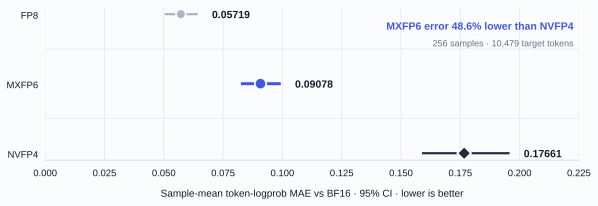
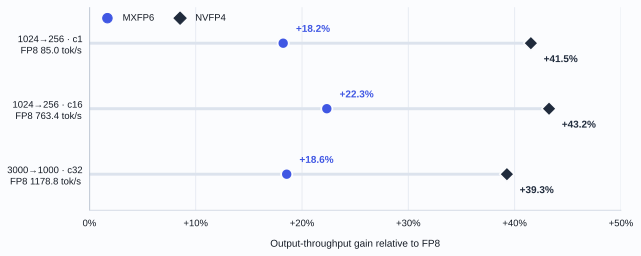
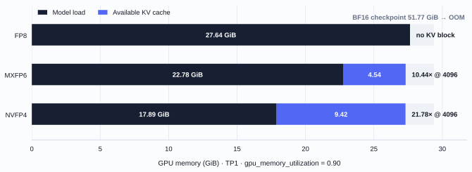

# Qwen3.8-27B on RTX 5090: MXFP6, FP8 and NVFP4

This snapshot compares three quantized Qwen3.8-27B paths in one frozen vLLM 0.25.1 environment. It measures BF16 token-logprob fidelity, TP2 serving performance and TP1 capacity. The image is an internal integration snapshot, not the public vLLM reproducer.

## Results

MXFP6 falls between FP8 and NVFP4 in BF16 fidelity. Its sample-mean token-logprob MAE is 48.6% lower than NVFP4's across 256 samples. FP8 remains closest to BF16.

*Points show the mean throughput gain across three workloads; horizontal bars are quality 95% CIs and vertical bars span the three workload gains. The dashed connector links measured formats only.*

| Format | MAE vs BF16 | Quality 95% CI | Mean throughput gain vs FP8 | Workload gain range |
|---|---:|---:|---:|---:|
| FP8 | 0.05719 | [0.05042, 0.06431] | +0.00% | +0.00% to +0.00% |
| MXFP6 | 0.09078 | [0.08250, 0.09932] | +19.71% | +18.23% to +22.33% |
| NVFP4 | 0.17661 | [0.15886, 0.19576] | +41.34% | +39.27% to +43.24% |

| Format | Sample-mean MAE vs BF16 | NLL absolute delta | Top-1 token agreement |
|---|---:|---:|---:|
| FP8 | 0.05719 | 0.02765 | 97.47% |
| MXFP6 | 0.09078 | 0.03970 | 96.57% |
| NVFP4 | 0.17661 | 0.07941 | 93.27% |

The quality set contains 64 GSM8K, 64 HumanEval, 64 HellaSwag and 64 CMMLU records. It contains 10,479 target tokens. Metrics first average target-token errors within each record, then weight all 256 records equally. The paired 95% sample-bootstrap interval for `NVFP4 MAE - MXFP6 MAE` is [0.07356, 0.09945].

| Domain | FP8 MAE | MXFP6 MAE | NVFP4 MAE | MXFP6 reduction vs NVFP4 |
|---|---:|---:|---:|---:|
| Math | 0.05334 | 0.10443 | 0.18021 | 42.0% |
| Code | 0.01888 | 0.03326 | 0.06797 | 51.1% |
| English | 0.12556 | 0.16689 | 0.35671 | 53.2% |
| Chinese | 0.03095 | 0.05852 | 0.10155 | 42.4% |

### TP2 serving

Every point uses two fresh service lifecycles in forward and reverse format order. Prompts contain deterministic random token IDs. The client forces the requested output length and checks server-reported token usage.

| Workload | FP8 output tok/s | MXFP6 output tok/s | NVFP4 output tok/s | MXFP6 vs FP8 | MXFP6 vs NVFP4 |
|---|---:|---:|---:|---:|---:|
| ISL 1024 / OSL 256 / c1 | 85.05 | 100.55 | 120.37 | +18.23% | -16.46% |
| ISL 1024 / OSL 256 / c16 | 763.43 | 933.91 | 1093.49 | +22.33% | -14.59% |
| ISL 3000 / OSL 1000 / c32 | 1178.75 | 1397.51 | 1641.67 | +18.56% | -14.87% |

*Output-throughput gain relative to FP8; each row is an independent workload.*

The largest two-run throughput range was 0.55% of its mean. The serving artifact retains both blocks, the full deterministic request contract, absolute TTFT and TPOT, repeat ranges, request counts, token totals, readiness snapshots and kernel-path checks. All throughput values above use TP2; no TP-size normalization was applied.

### TP1 capacity

The TP1 check uses max model length 4096, 4096 maximum batched tokens, 64 maximum sequences, eager execution and `gpu_memory_utilization=0.90`.

| Format | Checkpoint GiB | Model load GiB | Available KV GiB | 4096-token concurrency | Result |
|---|---:|---:|---:|---:|---|
| BF16 | 51.77 | — | — | — | failed |
| FP8 | 28.77 | 27.64 | -0.31 | — | failed |
| MXFP6 | 24.16 | 22.78 | 4.54 | 10.44 | ready |
| NVFP4 | 19.20 | 17.89 | 9.42 | 21.78 | ready |

FP8's failure means that the shared 90% memory-budget contract left no KV block. It does not establish that FP8 fails under every memory setting.

MXFP6's checkpoint is 16.0% smaller than FP8's and 25.8% larger than NVFP4's. Under this TP1 contract MXFP6 starts with 4.54 GiB of KV cache; NVFP4 retains more KV capacity but has the largest fidelity error.

## Fairness and environment

MXFP6 and NVFP4 quantize the same 400 matrices; their base-name sets match exactly. `lm_head` remains BF16 in both paths. MXFP6 uses OCP E3M2 weights with dynamic E4M3 activations in groups of 32. NVFP4 uses standard W4A4 with groups of 16.

The run used 8 x RTX 5090 GPUs, driver 595.71.05, vLLM 0.25.1 and image `sha256:d4d8ff2fef2eababb6833fcdbefb918a7af796f760298ba7dc42c190775abf9d`. TP2 service runs used the PIX-connected physical pair 6/7. Each timed block started from 2 MiB and 0% utilization on both GPUs.

## Claim boundary

- Token-logprob fidelity measures closeness to BF16; it is not task accuracy or human preference.
- Serving results apply to the recorded synthetic requests, runtime and hardware. They do not imply the same gain for every prompt length or concurrency.
- The data establish a measured trade-off among quality, throughput and capacity. They do not establish a universal Pareto optimum.
- The internal image digest makes this snapshot auditable but not independently reproducible. The public vLLM adapter remains a separate execution environment.

## Artifacts

- [`qwen38_27b_quality_fidelity.json`](../benchmarks/results/qwen38_27b_quality_fidelity.json)
- [`qwen38_27b_serving_tp2.json`](../benchmarks/results/qwen38_27b_serving_tp2.json)
- [`qwen38_27b_capacity_tp1.json`](../benchmarks/results/qwen38_27b_capacity_tp1.json)
- [`qwen38_27b_environment.json`](../benchmarks/results/qwen38_27b_environment.json)
- Figures are generated directly from these artifacts by [`plot_qwen38_snapshot.py`](../benchmarks/plot_qwen38_snapshot.py).
