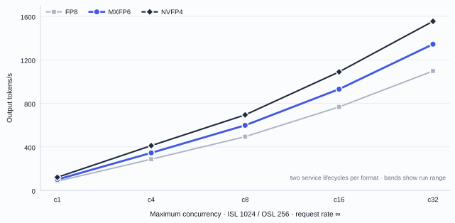

# Qwen3.8-27B on RTX 5090: where MXFP6 fits between FP8 and NVFP4

Quantized serving is not a winner-takes-all choice. FP8 prioritizes fidelity;
NVFP4 prioritizes throughput and memory. The useful question for MXFP6 is not
whether six bits beat both endpoints, but whether a native W6A8 path adds a
meaningful operating point between them.

On this Qwen3.8-27B and RTX 5090 stack, it does. MXFP6 stays closer to FP8 in
BF16 token-logprob fidelity while recovering roughly half of the measured
throughput and memory improvement from FP8 to NVFP4:

| Measured axis | FP8 | MXFP6 | NVFP4 | MXFP6 position from FP8 to NVFP4 |
|---|---:|---:|---:|---:|
| Sample-mean MAE vs BF16, lower is better | 0.05719 | 0.09078 | 0.17661 | 28.1% of the fidelity gap |
| TP2 throughput gain vs FP8, c1–c32 | baseline | +18.3% to +22.4% | +40.6% to +43.5% | 43.4% to 53.9% of the gain |
| TP2 model load, GiB/GPU | 14.09 | 11.46 | 9.05 | 52.2% of the saving |
| TP2 KV-cache capacity, tokens | 236,658 | 284,899 | 332,003 | 50.6% of the added capacity |
| Checkpoint size, GiB | 28.77 | 24.16 | 19.20 | 48.2% of the saving |

The last column is an endpoint normalization, not a composite score: 0% is the
measured FP8 value and 100% is the measured NVFP4 value on that axis. Fidelity,
throughput and memory do not share a common utility scale. The table shows where
MXFP6 lands; deployment requirements determine whether that point is useful.

## Why measure the complete serving path

MXFP6 SM120 stores weights as packed OCP E3M2 values with one UE8M0 scale per
32 values. BF16 or FP16 activations are dynamically quantized to E4M3, and the
native SM120 W6A8 kernel accumulates in FP32. The six-bit checkpoint only matters
to a serving system if the full path—including activation quantization,
scheduling, communication and attention—retains a useful speed and capacity
advantage.

This comparison therefore uses complete vLLM services rather than extrapolating
from GEMM microbenchmarks. It also compares deployable format paths, not weight
bits in isolation. MXFP6 uses W6A8 with groups of 32; standard NVFP4 uses W4A4
with groups of 16. Their activation formats and kernels differ by design.

## Experimental contract

All serving runs use a frozen vLLM 0.25.1 integration image on the same
PIX-connected pair of RTX 5090 GPUs with TP2. Each format uses the same maximum
model length, scheduler limits, 90% memory budget and text-only configuration.
The public BF16 reference is
[`Qwen/Qwen3.8-27B`](https://huggingface.co/Qwen/Qwen3.8-27B), and the official
FP8 baseline is
[`Qwen/Qwen3.8-27B-FP8`](https://huggingface.co/Qwen/Qwen3.8-27B-FP8).
MXFP6 and NVFP4 quantize the same 400 matrices; their base-name sets are
identical, and `lm_head` remains BF16 in both checkpoints.

The fixed serving sweep uses deterministic random token IDs, ISL 1024, OSL 256
and unlimited request rate at maximum concurrency 1, 4, 8, 16 and 32. The client
forces the output length and derives its throughput numerator from the server's
final token-usage block. The five points use 16, 32, 64, 128 and 256 prompts,
respectively. Every point is measured twice; each format uses two fresh service
lifecycles and runs all five points within each lifecycle. The first half uses
FP8 → MXFP6 → NVFP4 with ascending concurrency; the second uses the exact
reverse format and concurrency order.

Before each lifecycle, both GPUs had at most 2 MiB allocated and 0% utilization.
All 30 measured points completed every request, produced the exact requested
token counts, used identical request-contract hashes across formats and logged
the expected quantized kernel path. The largest two-run throughput range was
1.35% of its mean.

## Fidelity stays nearer the FP8 endpoint

The fidelity set contains 256 teacher-forced records: 64 each from GSM8K,
HumanEval, HellaSwag and CMMLU, for 10,479 target tokens. Metrics first average
target-token errors within each record and then weight all 256 records equally.

| Format | Sample-mean MAE vs BF16 | 95% CI | NLL absolute delta | Top-1 token agreement |
|---|---:|---:|---:|---:|
| FP8 | 0.05719 | [0.05042, 0.06431] | 0.02765 | 97.47% |
| MXFP6 | 0.09078 | [0.08250, 0.09932] | 0.03970 | 96.57% |
| NVFP4 | 0.17661 | [0.15886, 0.19576] | 0.07941 | 93.27% |

MXFP6's sample-mean MAE is 48.6% lower than NVFP4's, while FP8 remains
closest to BF16. The paired bootstrap interval for `NVFP4 MAE - MXFP6 MAE` is
[0.07356, 0.09945]. The ordering is also consistent in all four source domains:

| Domain | FP8 MAE | MXFP6 MAE | NVFP4 MAE | MXFP6 share of FP8→NVFP4 gap |
|---|---:|---:|---:|---:|
| Math | 0.05334 | 0.10443 | 0.18021 | 40.3% |
| Code | 0.01888 | 0.03326 | 0.06797 | 29.3% |
| English | 0.12556 | 0.16689 | 0.35671 | 17.9% |
| Chinese | 0.03095 | 0.05852 | 0.10155 | 39.1% |

The 28.1% position is not unique to sample-mean MAE. MXFP6 occupies 30.5% of
the FP8→NVFP4 gap in token-weighted MAE, 23.3% in NLL absolute delta and 21.4%
in top-1 disagreement. These metrics measure closeness to BF16, not downstream
task accuracy or human preference.

## The throughput gain survives the concurrency sweep

| Maximum concurrency | FP8 output tok/s | MXFP6 output tok/s | NVFP4 output tok/s | MXFP6 vs FP8 | MXFP6 vs NVFP4 | Share of NVFP4 gain |
|---:|---:|---:|---:|---:|---:|---:|
| 1 | 84.98 | 100.49 | 120.70 | +18.26% | -16.74% | 43.44% |
| 4 | 286.81 | 345.32 | 411.70 | +20.40% | -16.12% | 46.85% |
| 8 | 494.06 | 598.47 | 694.44 | +21.13% | -13.82% | 52.11% |
| 16 | 767.30 | 930.59 | 1,089.38 | +21.28% | -14.58% | 50.70% |
| 32 | 1,097.49 | 1,343.67 | 1,554.27 | +22.43% | -13.55% | 53.89% |

MXFP6 remains between the two endpoints at every measured concurrency. Its
mean TPOT is 15.4%–17.4% lower than FP8's, and its mean output throughput is
18.3%–22.4% higher. The gain increases slightly rather than disappearing as the
service moves from a single active request to the higher-concurrency region.

A separate workload matrix reaches the same conclusion across three request
shapes: ISL 1024 / OSL 256 / c1, ISL 1024 / OSL 256 / c16 at 20 requests/s,
and ISL 3000 / OSL 1000 / c32 at 20 requests/s. MXFP6 was 18.23%–22.33% faster
than FP8 and 14.59%–16.46% slower than NVFP4 in those runs. Those independent
points are retained in the serving artifact; the fixed sweep above is the
cleaner evidence for concurrency scaling.

## Weight savings become serving capacity

Under the same TP2 service contract, checkpoint savings translated into lower
model load per GPU and more room for KV cache:

| Format | Model load GiB/GPU | Available KV GiB/GPU | GPU KV-cache tokens | 4096-token concurrency |
|---|---:|---:|---:|---:|
| FP8 | 14.09 | 12.46 | 236,658 | 57.78× |
| MXFP6 | 11.46 | 14.99 | 284,899 | 69.56× |
| NVFP4 | 9.05 | 17.47 | 332,003 | 81.06× |

The capacity fields are means from the same two service lifecycles used for the
fixed sweep. The runtime reported a 2,731-token range for FP8, 6,372 for MXFP6
and 2,276 for NVFP4 across the paired starts.

The earlier TP1 fit check provides a stricter single-GPU boundary. At max model
length 4096, 4096 maximum batched tokens, 64 maximum sequences and
`gpu_memory_utilization=0.90`, BF16 ran out of memory and FP8 left no KV block.
MXFP6 started with 4.54 GiB of KV cache and NVFP4 with 9.42 GiB:

| Format | Checkpoint GiB | Model load GiB | Available KV GiB | 4096-token concurrency | Result |
|---|---:|---:|---:|---:|---|
| BF16 | 51.77 | — | — | — | failed |
| FP8 | 28.77 | 27.64 | -0.31 | — | failed |
| MXFP6 | 24.16 | 22.78 | 4.54 | 10.44× | ready |
| NVFP4 | 19.20 | 17.89 | 9.42 | 21.78× | ready |

FP8's result means that this shared 90% memory contract left no KV block. It
does not establish that FP8 fails under every possible memory setting.

## Reading the trade-off

| Format | What this snapshot favors | What it gives up |
|---|---|---|
| FP8 | Lowest measured BF16-fidelity error | Lowest throughput and KV capacity among the quantized TP2 paths |
| MXFP6 | Roughly half of the measured FP8→NVFP4 throughput and memory gain while staying nearer FP8 in fidelity | Slower and larger than NVFP4; less faithful than FP8 |
| NVFP4 | Highest measured throughput and KV capacity | Largest measured BF16-fidelity error |

This makes MXFP6 a deployment option, not a universal replacement. A service
whose quality gate accepts NVFP4 should take its additional throughput and
capacity. A service whose gate requires the closest measured approximation to
BF16 should use FP8 when it fits. MXFP6 is relevant when FP8 leaves performance
or capacity on the table, but the observed NVFP4 fidelity movement is too large
for the deployment's own acceptance criteria.

## Limits and reproducibility

- Token-logprob fidelity is not task accuracy or human preference.
- Synthetic serving requests isolate the recorded service paths; they do not
  represent every production prompt distribution or scheduler policy.
- Results apply to Qwen3.8-27B, RTX 5090, the recorded TP sizes and the frozen
  runtime. They do not establish a universal Pareto optimum.
- The internal image digest makes this snapshot auditable but not independently
  reproducible. The public vLLM adapter remains a separate execution environment.
- The comparison is between complete FP8, MXFP6 W6A8 and NVFP4 W4A4 paths. It
  does not attribute the observed differences to weight precision alone.

Checked-in artifacts:

- [`qwen38_27b_quality_fidelity.json`](../benchmarks/results/qwen38_27b_quality_fidelity.json)
- [`qwen38_27b_concurrency_tp2.json`](../benchmarks/results/qwen38_27b_concurrency_tp2.json)
- [`qwen38_27b_serving_tp2.json`](../benchmarks/results/qwen38_27b_serving_tp2.json)
- [`qwen38_27b_capacity_tp1.json`](../benchmarks/results/qwen38_27b_capacity_tp1.json)
- [`qwen38_27b_environment.json`](../benchmarks/results/qwen38_27b_environment.json)

All figures are generated from the checked-in JSON by
[`plot_qwen38_snapshot.py`](../benchmarks/plot_qwen38_snapshot.py).
